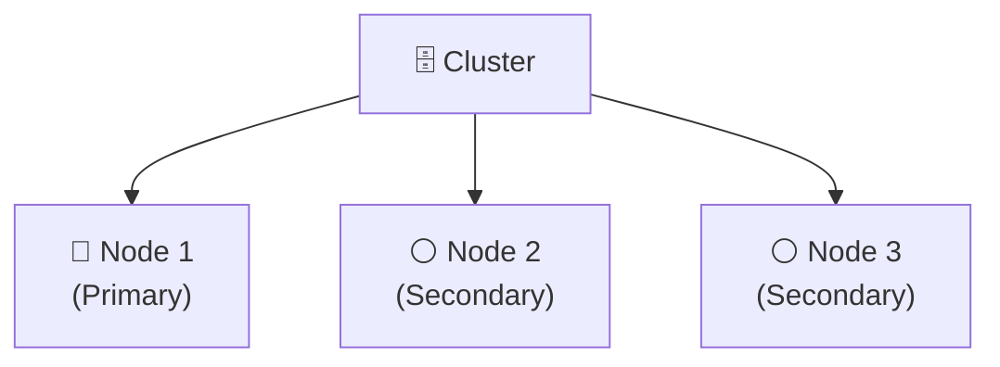
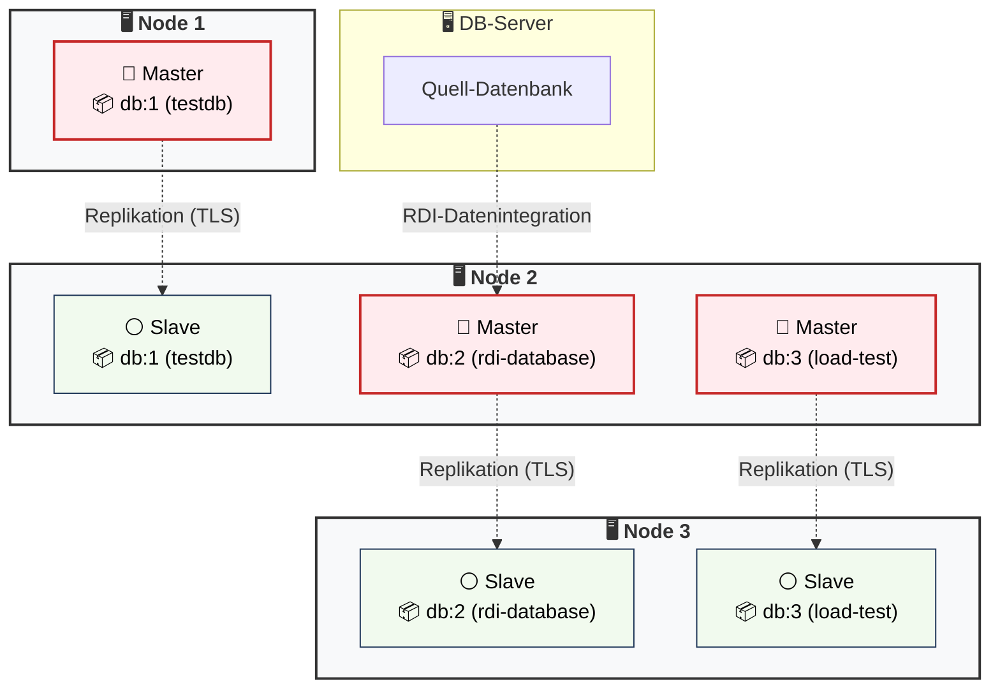

#  Redis Enterprise – Linux (3-Node Cluster)

- [💾 Installation und Cluster Setup](#-installation-und-cluster-setup)
- [🧩 Cluster Aufbau](#-cluster-aufbau)
  - [🔗 Infrastruktur & Nodes](#-infrastruktur--nodes)
  - [📦 Datenbanken](#-datenbanken)
- [📑 Sichere Datenbankkonfiguration](#-sichere-datenbankkonfiguration)
  - [🔐 TLS & Verschlüsselung](#-tls--verschluesselung)
  - [🌐 Netzwerk & Ports](#-netzwerk--ports)
  - [👥 Nutzerverwaltung](#-nutzerverwaltung)
  - [📘 Protokollierung](#-protokollierung)
  - [♻️ Persistenz, Backups und Restore](#-persistenz-backups-und-restore)
  - [⚡ Hochverfügbarkeit (HA)](#-hochverfuegbarkeit-ha)
  - [🧩 Zusammenfassung zur sicheren Konfiguration](#-zusammenfassung-zur-sicheren-konfiguration)
- [🎛️ Verwaltung & CLI-Befehle](#-verwaltung--cli-befehle)

---

## 💾 Installation und Cluster Setup

**Installation:**

1. Download der aktuellen Version von https://redis.io/de/downloads/#Redis_Software
2. Datei entpacken mit `tar -xvf [Dateiname].tar`
3. Installation mit `sudo ./install.sh` starten und Anweisungen folgen
4. Nach erfolgreicher Installation sollte Management UI über `https://localhost:8443` erreichbar sein

**Cluster Setup:**

1. Management UI aufrufen
2. "Create new cluster" wählen
3. Admin Credentials erstellen
4. Lizenz und FQDN angeben
5. Speicher und Netzwerk konfigurieren
6. Mit "Create cluster" das Cluster erstellen

> [!TIP]
> **HA-Grundlage:** Die drei Nodes vor dem Anlegen produktiver Datenbanken auf **drei getrennte Racks beziehungsweise Availability Zones** verteilen. Anschließend Rack-Zone-Awareness aktivieren. Dadurch können Primary- und Replica-Shards über getrennte Fehlerdomänen platziert werden.

**Weitere Schritte:**
- Nodes dem Cluster hinzufügen
- Datenbanken anlegen
- Weitere Konfigurationen, siehe [📑 Sichere Datenbankkonfiguration](#-sichere-datenbankkonfiguration)

---

## 🧩 Cluster Aufbau

Beispielhafter Cluster-Aufbau mit 3 Knoten und 3 Datenbanken.

**3-Node Redis Enterprise Cluster** (Version `8.0.10`)

### 🔗 Infrastruktur & Nodes



### 📦 Datenbanken

1. `db:1` (`testdb`)
2. `db:2` (`rdi-database`)
3. `db:3` (`load-test`)

**Verteilung der Datenbanken auf den Nodes:**

Redis Enterprise plant und verteilt Shards automatisch anhand von Datenbank-, Ressourcen- und Platzierungsrichtlinien. Für Produktionsdatenbanken Replikation und Rack-Zone-Awareness bewusst aktivieren; die resultierende Platzierung anschließend prüfen.



---

## 📑 Sichere Datenbankkonfiguration

Verschiedene Konfigurationen für Redis werden in Konfigurationsdateien abgelegt. Abhängig von der Installation können diese in folgenden Ordnern liegen:
- `/opt/redislabs`
- `/var/opt/redislabs`
- `/etc/opt/redislabs`
- `/usr/share/doc/redislabs`

(Diese sollten nicht manuell editiert werden!).

> [!NOTE]
Im Gegensatz zum klassischen Redis existiert keine zentrale `redis.conf`, die alle Parameter steuert. Auf jedem Node existiert eine Konfigurationsdatei (z.B. redis-2.conf) in der Teile der Konfiguration gespeichert sind. 

Generell ist die Konfiguration hierarchisch aufgeteilt:
1. **Cluster-Ebene:** Globale Parameter und Cluster-Zustand. 
2. **Datenbank-Ebene:** Jede DB besitzt dedizierte Einstellungen, die über Proxies an die Shards weitergegeben werden.

Für die Konfiguration wird die Verwendung der Web UI empfohlen. 

---

### 🔐 TLS & Verschlüsselung

Es wird empfohlen TLS für den Datenaustausch zu aktivieren.

#### Umsetzung in Management UI

1. "Databases" wählen
2. Datenbank auswählen
3. "Security" wählen
4. "TLS - Transport Layer Security for secure connections" aufklappen
5. TLS aktivieren und "Clients and databases + Between databases" wählen

#### Prüfen der Konfiguration mit rladmin

1. Befehl `rladmin status extra all` ausführen
2. Unter "ENDPOINTS" in der Spalte "SSL" den Eintrag für die jeweilige Datenbank prüfen

---

### 🌐 Netzwerk & Ports

Folgende Ports müssen auf den Linux-Systemen restriktiv über die Firewall abgesichert werden:

**WebUI Port:**

| Parameter | Portnummer | Dienst | Erlaubte Quell-Ziele |
| --- | --- | --- | --- |
| `cm_port` | `8443` | Management UI | Nur Admin-IPs |

**Datenbank-Port:**

| Portnummer (Beispiel) | Dienst | Erlaubte Quell-Ziele |
| --- | --- | --- |
| `12000` | `testdb` Proxy | Nur Applikations-Server |
| `12001` | `rdi-database` Proxy | Nur RDI-Worker / Ziel-Systeme |

---

### 👥 Nutzerverwaltung

Es wird empfohlen, ein rollenbasiertes Zugriffskonzept umzusetzen mit minimalen Berechtigungen (Least Privilege).

#### Umsetzung einer rollenbasierten Zugriffsberechtigung

Anlegen von Rollen und Nutzern:
1. Erstellen von ACLs (Access Control List).
2. Anlegen von Rollen und Zuweisung der jeweiligen ACLs (RBACs).
3. Anlegen von Nutzern und Zuweisung der jeweiligen Rolle.
4. In der Datenbank unter **Security** nur die erforderlichen Rollen und ACLs zuordnen.
5. Für neue Umgebungen den Default-User deaktivieren, sofern keine Legacy-Kompatibilität erforderlich ist.

#### Umsetzung in Management UI

ACL und Nutzer anlegen:
1. "Access Control" auswählen
2. "Roles" wählen und ACLs und Rollen anlegen
3. "User" wählen und Nutzer anlegen

Zuweisung einer ACL zur Datenbank:
1. "Databases" wählen
2. Datenbank auswählen
3. "Security" wählen
4. "Edit" wählen
5. In "Access Control" den Punkt "Using ACL only" wählen und die Nutzer hinzufügen

---

### 📘 Protokollierung

#### Cluster Protokollierung

Alle Management- und Cluster-Aktionen in Redis Enterprise werden protokolliert.

##### Log in Management UI ansehen

1. Auf Startseite zu "Cluster" wechseln
2. Menüpunkt "Logs" wählen, um die chronologische Liste der Cluster-Ereignisse einzusehen.

##### Log in CLI abrufen

Die Protokolle befinden sich standardmäßig im Verzeichnis `/var/opt/redislabs/log`. Die wichtigsten Dateien sind:
* `event_log.log`: Zentrale Cluster- und Management-Events.
* `redis/redis-<db_id>.log`: Spezifische Laufzeit-Logs der einzelnen Redis-Shards (Engine-Ebene).

#### Datenbank Protokollierung

##### Slow Log

Überwachung von Befehlen mit hoher Laufzeit auf Shard-Ebene. 

Es wird empfohlen, die folgenden Parameter an die Gegebenheiten der Umgebung anzupassen.

| Parameter           | Bedeutung                    | Empfehlung |
|---------------------|------------------------------|------------|
| `slowlog-log-slower-than` | Schwellwert, ab dem Vorgänge protokolliert werden | 10.000 µs (systemabhängig) |
| `slowlog-max-len` | maximale Anzahl der gespeicherten Einträge | 128 (systemabhängig) |

#### Log-Zentralisierung (SIEM/Syslog)

Es wird empfohlen, die native Syslog-Weiterleitung zu aktivieren. Alle Cluster-Events und administrativen Aktionen sollten an ein zentrales Log-Management- oder SIEM-System übergeben werden. Hierbei sollte die Übertragung mittels TLS verschlüsselt sein.

---

### ♻️ Persistenz, Backups und Restore

Persistenz und periodische Backups sind getrennte Schutzmechanismen:

- **Persistenz** (AOF oder Snapshots) schützt gegen Prozess- und Serverausfälle.
- **Periodische Backups** ermöglichen Wiederherstellung nach schwerwiegenderen Fehlern.


Für jede Produktionsdatenbank Backup-Ziel, Aufbewahrung, Zugriffsschutz/Verschlüsselung sowie einen regelmäßigen Restore-Test festlegen und dokumentieren.

##### Backup in Management UI einrichten

1. Auf Startseite "Databases" wählen
2. Menüpunkt "Configuration" wählen
3. Sektion "Durability" aufklappen
4. Mit "+Add backup path" Pfad für das Backup festlegen
5. Intervall für das Backup definieren

---

### ⚡ Hochverfügbarkeit (HA)

Die Hochverfügbarkeit von Redis Enterprise basiert auf einer automatisierten Master-Replica-Architektur auf Shard-Ebene. 
Standardmäßig ist die Hochverfügbarkeit aktiviert. Fällt ein Primary-Shard aus, wird seine Replica automatisch zum neuen Primary befördert. „Replica high availability“ hilft zusätzlich, nach einem Node-Ausfall verlorene Replicas wiederherzustellen.

#### Prüfen/Aktivieren der Hochverfügbarkeit

1. Auf Startseite "Databases" wählen
2. Menüpunkt "Configuration" wählen
3. Sektion "High Availability" aufklappen
4. "Replication" aktivieren
5. "Replica high availability" aktivieren

---

### 🧩 Zusammenfassung zur sicheren Konfiguration

* **Transportverschlüsselung (TLS) aktivieren:** Für alle Datenbanken sollte TLS aktiviert werden, da sonst unverschlüsselte Daten im internen Netzwerk im Klartext mitgelesen werden können.
* **Restriktive Firewall-Regeln anwenden:** Die kritischen Management-Ports (z.B. `8443`) sollten nur für Admin-IPs freigegeben sein. Generell sollte über Firewall Regeln die Zugriffe auf die verschiedenen Ports der Nodes geprüft werden.
* **Rollenbasierten Zugriff (RBAC) mittels ACL umsetzen:** Jede Datenbank darf nur für dedizierte Nutzer zugänglich sein. Diese sollten über ACL-Rollen auf die benötigten Befehle beschränkt sein.
* **Log-Zentralisierung mittels Syslog einrichten:** Alle Cluster- und Audit-Ereignisse sollten an ein zentrales SIEM-System weitergeleitet werden.
* **Backups konfigurieren:** Jede Datenbank benötigt zyklische Backups auf externem Speicher.
* **Hochverfügbarkeit aktivieren:** Replikation für alle Produktivdatenbanken aktivieren, um Single Points of Failure auszuschließen.
* **Keine manuellen Datei-Edits durchführen:** Da Redis Enterprise Konfigurationen dynamisch im zentralen Cluster Store verwaltet, sollten Parameter in der Regel über die WebUI, `rladmin` oder Redis CLI geändert werden.
* **Inter-Node Encryption:** Kommunikation zwischen den Nodes mittels TLS absichern.

---

## 🎛️ Verwaltung & CLI-Befehle

### Prüfung des Cluster-Status
```bash
rladmin status
```

### Erweiterten Cluster-Gesamtstatus anzeigen
Um tiefergehende Metriken zu Shard-Migrationen, Replikations-Gaps (Lag) und Auslastungen einzusehen, führe diesen Befehl aus:
```bash
rladmin status extra all
```

### Detaillierte Cluster-Tuning-Parameter

```bash
rladmin info cluster
```

### Node Übersicht abrufen

```bash
rladmin info node
```

### 🔍 Cluster-Validierung durchführen

Mit den integrierten Validierungs-Tools von Redis Enterprise kann der Zustand des Clusters überprüft werden:

```bash
rladmin status issues_only
rladmin verify rack_aware
rlcheck
```

### 🔐 Informationen zur Datenbank anzeigen
Um eine verschlüsselte Verbindung mit spezifischen ACL-Benutzern zu einer Datenbank aufzubauen und Infos abzufragen, kann dieser Befehl genutzt werden:

```bash
redis-cli \
  -h <FQDN> \
  -p <Port-Nummer> \
  --tls \
  --cacert /etc/opt/redislabs/proxy_cert.pem \
  --user <Nutzername> \
  --askpass
```
Alternativ zur Passworteingabe kann mit `REDISCLI_AUTH` das Passwort als Umgebungsvariable gesetzt werden.

Nach erfolgreichem Verbindungsaufbau:
```redis
INFO
CONFIG GET slowlog-log-slower-than
```

---

© 2026 – Sichere Datenbankkonfigurationen