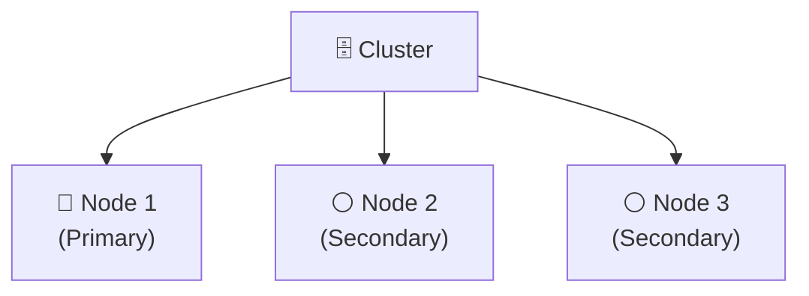
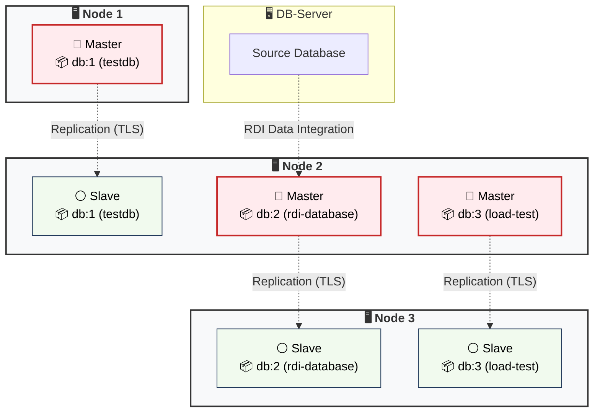

#  Redis Enterprise – Linux (3-Node Cluster)

- [💾 Installation and Cluster Setup](#-installation-and-cluster-setup)
- [🧩 Cluster Architecture](#-cluster-architecture)
  - [🔗 Infrastructure & Nodes](#-infrastructure--nodes)
  - [📦 Databases](#-databases)
- [📑 Secure Database Configuration](#-secure-database-configuration)
  - [🔐 TLS & Encryption](#-tls--encryption)
  - [🌐 Network & Ports](#-network--ports)
  - [👥 User Management](#-user-management)
  - [📘 Logging](#-logging)
  - [♻️ Persistence, Backups, and Restore](#-persistence-backups-and-restore)
  - [⚡ High Availability (HA)](#-high-availability-ha)
  - [🧩 Summary of Secure Configuration](#-summary-of-secure-configuration)
- [🎛️ Management & CLI Commands](#-management--cli-commands)

---

## 💾 Installation and Cluster Setup

**Installation:**

1. Download the latest version from https://redis.io/de/downloads/
2. Extract the file using `tar -xvf [filename].tar`
3. Start the installation with `sudo ./install.sh` and follow the instructions
4. After successful installation, the Management UI should be accessible via `https://localhost:8443`

**Cluster Setup:**

1. Access the Management UI
2. Select "Create new cluster"
3. Create admin credentials
4. Provide the license and FQDN
5. Configure storage and networking
6. Click "Create cluster" to initialize the cluster

> [!TIP]
> **HA Foundation:** Before creating production databases, distribute the three nodes across **three separate racks or Availability Zones**. Then activate Rack-Zone Awareness. This allows primary and replica shards to be placed across separate fault domains.

**Further Steps:**
- Add nodes to the cluster
- Create databases
- For additional configurations, see [📑 Secure Database Configuration](#-secure-database-configuration)

---

## 🧩 Cluster Architecture

Example cluster setup with 3 nodes and 3 databases.

**3-Node Redis Enterprise Cluster** (Version `8.0.10`)

### 🔗 Infrastructure & Nodes



### 📦 Databases

1. `db:1` (`testdb`)
2. `db:2` (`rdi-database`)
3. `db:3` (`load-test`)

**Distribution of Databases Across Nodes:**

Redis Enterprise automatically schedules and distributes shards based on database, resource, and placement policies. Explicitly enable replication and Rack-Zone Awareness for production databases, then verify the resulting shard placement.



---

## 📑 Secure Database Configuration

Various configurations for Redis are stored in configuration files. Depending on the installation, these can be located in the following directories:
- `/opt/redislabs`
- `/var/opt/redislabs`
- `/etc/opt/redislabs`
- `/usr/share/doc/redislabs`

> [!WARNING]
> Unlike open-source Redis, there is no single central `redis.conf` controlling all parameters. On each node, there is a configuration file (e.g. redis-2.conf) in which parts of the configuration are stored.

Generally, the configuration is structured hierarchically:
1. **Cluster Level:** Global parameters and cluster state.
2. **Database Level:** Each database has dedicated settings delivered to shards via proxies.

Using the Web UI for configuration is recommended.

---

### 🔐 TLS & Encryption

It is recommended to enable TLS for all data transfer.

#### Implementation in Management UI

1. Select "Databases"
2. Choose the database
3. Select "Security"
4. Expand "TLS - Transport Layer Security for secure connections"
5. Enable TLS and select "Clients and databases + Between databases"

#### Verifying Configuration with `rladmin`

1. Execute the command `rladmin status extra all`
2. Under "ENDPOINTS", check the "SSL" column for the respective database

---

### 🌐 Network & Ports

The following ports must be restrictively secured via firewalls on Linux systems:

**WebUI Port:**

| Parameter | Port Number | Service | Allowed Sources/Destinations |
| --- | --- | --- | --- |
| `cm_port` | `8443` | Management UI | Admin IPs only |

**Database Ports (Examples):**

| Port Number | Service | Allowed Sources/Destinations |
| --- | --- | --- |
| `12000` | `testdb` Proxy | Application servers only |
| `12001` | `rdi-database` Proxy | RDI workers / target systems only |

---

### 👥 User Management

Implementing a role-based access control (RBAC) model following the Principle of Least Privilege is recommended.

#### Implementing Role-Based Access Control

Creating Roles and Users:
1. Create ACLs (Access Control Lists).
2. Create roles and assign respective ACLs.
3. Create users and assign the respective role.
4. In the database under **Security**, assign only the required roles and ACLs.
5. For new environments, disable the default user unless legacy compatibility is required.

#### Implementation in Management UI

Create ACLs and Users:
1. Select "Access Control"
2. Select "Roles" to create ACLs and roles
3. Select "Users" to create users

Assigning an ACL to a Database:
1. Select "Databases"
2. Choose the database
3. Select "Security"
4. Click "Edit"
5. Under "Access Control", select "Using ACL only" and add the users

---

### 📘 Logging

#### Cluster Logging

All management and cluster actions in Redis Enterprise are audited and logged.

##### Viewing Logs in Management UI

1. Go to "Cluster" on the home page
2. Select "Logs" to view the chronological list of cluster events

##### Retrieving Logs via CLI

Logs are located by default in `/var/opt/redislabs/log`. The key files are:
* `event_log.log`: Central cluster and management events.
* `redis/redis-<db_id>.log`: Specific runtime logs for individual Redis shards (engine level).

#### Database Logging

##### Slow Log

Monitoring commands with long execution times at the shard level.

It is recommended to adapt the following parameters to your environment:

| Parameter | Meaning | Recommendation |
| --- | --- | --- |
| `slowlog-log-slower-than` | Threshold above which commands are logged | `10000` µs (10 ms, system-dependent) |
| `slowlog-max-len` | Maximum number of logged entries | `128` (system-dependent) |

#### Log Centralization (SIEM/Syslog)

It is recommended to enable native Syslog forwarding. All cluster events and administrative actions should be forwarded to a central log management or SIEM system, encrypted via TLS.

---

### ♻️ Persistence, Backups, and Restore

Persistence and periodic backups are distinct protection mechanisms:
- **Persistence** (AOF or snapshots/RDB) protects against process and node failures.
- **Periodic Backups** enable recovery after more severe errors or data corruption.

For every production database, define and document the backup target, retention policy, access/encryption protection, and schedule regular restore tests.

##### Setting Up Backups in Management UI

1. Select "Databases" on the home page
2. Go to "Configuration"
3. Expand the "Durability" section
4. Click "+Add backup path" to set the destination path
5. Define the backup interval

---

### ⚡ High Availability (HA)

Redis Enterprise High Availability is based on an automated primary-replica shard architecture. 
High Availability is enabled by default. If a primary shard fails, its replica is automatically promoted to primary. "Replica high availability" additionally helps recreate lost replicas after a node failure.

#### Checking/Enabling High Availability

1. Select "Databases" on the home page
2. Go to "Configuration"
3. Expand the "High Availability" section
4. Enable "Replication"
5. Enable "Replica high availability"

---

### 🧩 Summary of Secure Configuration

* **Enable Transport Encryption (TLS):** TTLS should be enabled for all databases, as otherwise unencrypted data could be read in plain text on the internal network.
* **Apply Restrictive Firewall Rules:** Critical management ports (e.g. `8443`) should only be opened for admin IP addresses. As a general rule, firewall rules should be used to monitor access to the various ports on the nodes.
* **Implement Role-Based Access Control (RBAC):** Each database must only be accessible to designated users. These users should be restricted to the necessary commands via ACL roles.
* **Set Up Log Centralization via Syslog:** Forward all cluster and audit events to a central SIEM system.
* **Configure Backups:** Ensure cyclic backups to external storage for every database.
* **Enable High Availability:** Enable replication for all production databases to eliminate Single Points of Failure.
* **Avoid Manual File Edits:** Manage configurations dynamically via WebUI, `rladmin`, or REST API rather than editing configuration files directly.
* **Inter-Node Encryption:** Secure communication between nodes using TLS.

---

## 🎛️ Management & CLI Commands

### Checking Cluster Status
```bash
rladmin status
```

### Display Extended Overall Cluster Status
To view deeper metrics on shard migrations, replication lag, and resource utilization:
```bash
rladmin status extra all
```

### Detailed Cluster Tuning Parameters
```bash
rladmin info cluster
```

### Retrieve Node Overview
```bash
rladmin info node
```

### 🔍 Perform Cluster Validation

Redis Enterprise’s built-in validation tools can be used to check the status of the cluster:

```bash
rladmin status issues_only
rladmin verify rack_aware
rlcheck
```

### 🔐 Display Database Information
To establish an encrypted connection using specific ACL users and query database info:

```bash
redis-cli \
  -h <FQDN> \
  -p <Port-Number> \
  --tls \
  --cacert /etc/opt/redislabs/proxy_cert.pem \
  --user <Username> \
  --askpass
```

Alternatively, you can supply the password via the `REDISCLI_AUTH` environment variable.

After establishing a connection:
```redis
INFO
CONFIG GET slowlog-log-slower-than
```

---

© 2026 – Secure Database Configurations